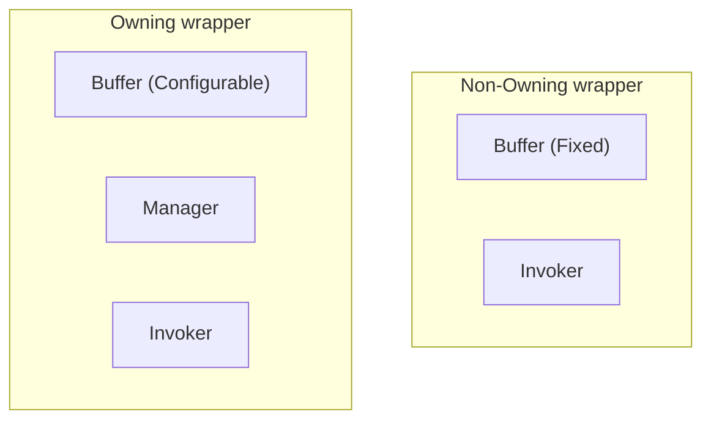

# Embedded Function

<p align="center">
  
  
  
</p>

<p align="center">
  <a href="https://github.com/Kim-J-Smith/Embedded-Function/actions/workflows/test.yml">
    
    
    
    
  </a>
</p>

> *A **lightweight** and **heap-free** polymorphic function wrapper collection.*

## 📌 Overview

*Embedded Function* is a **lightweight** and **no-heap-allocation** function wrapper collection implemented based on the C++11 standard, optimized([see below](#-performance-optimization)) for resource-constrained or high-performance environments.

The library is [freestanding](https://cppreference.com/w/cpp/freestanding), making it feasible for embedded development or kernel design of an operating system.

In a [single header file](./include/embed/embed_function.hpp), **five** function wrappers are provided as follows (the customizable [`ebd::basic_fn`](./docs/api/basic_fn.md) is the fifth):

```cpp
namespace ebd {
template <class Signature, size_t BufferSize = /*DefaultSize*/>
  class fn; // Wrapper for copyable callable objects.
template <class Signature, size_t BufferSize = /*DefaultSize*/>
  class unique_fn; // Wrapper for movable, especially move-only callable objects.
template <class Signature, size_t BufferSize = /*DefaultSize*/>
  class classic_fn; // Wrapper for copyable callable objects (throws on empty, like std::function).
template <class Signature, size_t Unused = 0>
  class fn_ref; // View (non-owning wrapper) for callable objects.
}
```

## ⚡ Quick start
- Clone the repository or download the `header_only.zip` in the "Release".

- Add include path `<repo_root>/include`.

- In program `#include "embed/embed_function.hpp"`.

- Use the `ebd::fn` template class.

```cpp
#include <iostream>
#include "embed/embed_function.hpp"

struct Example {
    static void static_mem_fn(int n) { std::cout << "Calling with number: " << n << "\n"; }
    void mem_fn(int n) const { std::cout << "Calling with number: " << n << "\n"; }
    void operator()(int n) { std::cout << "Calling with number: " << n << "\n"; }
};

auto main() -> int {
    Example e;
    ebd::fn<void(int)> fn_;

    fn_ = &Example::static_mem_fn;
    fn_(123); // Prints "Calling with number: 123"

    fn_ = [e](int arg) { e.mem_fn(arg); };
    fn_(456); // Prints "Calling with number: 456"

    fn_ = e;
    fn_(789); // Prints "Calling with number: 789"
}
```

> More examples are available in the [`example/`](./example/) directory.

## 🔧 Wrapper definition syntax

```cpp
/// The definition of method of a function wrapper is as follows:
        FnWrapper <void(int, char) const, 3*sizeof(void*)> fn_ = +[](int, char) {};
//          ^       ^   ^~~~~~~      ^     ^~~~~~                 ^~~~~~~~~~~~~
//          |       |   |            |     |                      |
// Function wrapper |   |            |     |                      |
// Return type ~~~~~|   |            |     |                      |
// Parameters ~~~~~~~~~~|            |     |                      |
// Qualifier ~~~~~~~~~~~~~~~~~~~~~~~~|     |                      |
// Buffer size ~~~~~~~~~~~~~~~~~~~~~~~~~~~~|                      |
// Callable object ~~~~~~~~~~~~~~~~~~~~~~~~~~~~~~~~~~~~~~~~~~~~~~~|
```

- *`Function wrapper`*: One of `ebd::fn`, `ebd::unique_fn`, `ebd::classic_fn` and `ebd::fn_ref`.

- *`Return type`*: A type that can be implicitly converted from the direct return type of *`Callable object`*.

- *`Parameters`*: Types that can implicitly converts to the parameter types of *`Callable object`*.

- *`Qualifier`*: Applies to the wrapper's `operator()` (e.g., `const`, `noexcept`, `&`, `&&`), restricting which callable objects can be stored.

- *`Buffer size`*: Size (in bytes) of the internal storage. Triggers `static_assert` if insufficient - no heap allocation.

- *`Callable object`*: Any entity callable with the target signature (function pointer, lambda, function object, `std::reference_wrapper`). Copied or moved into the buffer depending on wrapper type.

## 🧠 Design goals driving the design

  - Should behave close to a normal function pointer. Small, efficient, no heap allocation.

  - Support the packaging of all callable objects in C++, including:
    - Free function.
    - Lambda function.
    - Functor.
    - Static member function.
    - Member function.

  - Be usable with C++11 while offering more functionality for later editions.

  - Be constexpr and exception friendly. As much as possible should be declared constexpr and noexcept.

  - Should be based on the analysis of [N4159](https://www.open-std.org/jtc1/sc22/wg21/docs/papers/2014/n4159.pdf), [P2548](https://www.open-std.org/jtc1/sc22/wg21/docs/papers/2023/p2548r6.pdf) and [LWG2393](https://cplusplus.github.io/LWG/issue2393), and should avoid repeating the mistakes made by `std::function`. Therefore, *Embedded Function* should:

    - *NOT* implement the method `target()` and `target_type()`.
    - Allow the application of qualifiers, such as `const`, `volatile`, `&` and `&&`, to the function signature.
    - Ensure that the qualifier of the underlying object is consistent or more restrictive than that of the function signature.

  - Learn and refer to the optimization experience of `std::function` in libc++, libstdc++, MSVC STL.

  - Provide a view or reference to the callable object, referring to the [`std::function_ref` P0792](https://www.open-std.org/jtc1/sc22/wg21/docs/papers/2023/p0792r14.html).

  - Following the above design goals, `ebd::fn`, `ebd::unique_fn`, `ebd::classic_fn` and `ebd::fn_ref` were designed for developers to use.

## ✨ Core function wrappers

### Summary table

| Wrapper Type | Copyable | View (Non-owning) | Throws on Empty Call | Assert No-Throw (Ctor/Dtor) | Buffer Size | Primary Use Case |
| :----------- | :---: | :---: | :---: | :---: | :---: | :---: |
| [`ebd::fn`](./docs/api/fn.md)    |  Yes  |   No  | No (`std::terminate()`) | No | Configurable (aligned, default: `sizeof(void(Class::*)())`) | Copyable callable wrapper |
| [`ebd::unique_fn`](./docs/api/unique_fn.md)    |  No  |   No  | No (`std::terminate()`) | No | Configurable (aligned, default: `sizeof(void(Class::*)())`) | Move-only callable wrapper |
| [`ebd::classic_fn`](./docs/api/classic_fn.md)    |  Yes  |   No  | Yes (`std::bad_function_call`) | No | Configurable (aligned, default: `sizeof(void(Class::*)())`) | Classic wrapper (like `std::function`) |
| [`ebd::fn_ref`](./docs/api/fn_ref.md)    |  Yes  |   Yes  | No (**NO EMPTY STATE**) | No | Fixed | Lightweight non-owning  reference(view) of callables |
| [`ebd::basic_fn`](./docs/api/basic_fn.md) | - | - | - | - | - | Customized by the user |

### Key takeaways

1. **Ownership & Copy**: `fn`/`classic_fn` own callables (copyable), `unique_fn` owns but is move-only, `fn_ref` is non-owning (view).

2. **Exception Behavior**: `fn`/`unique_fn` terminate on empty calls (no exceptions); `classic_fn` throws `std::bad_function_call` (like `std::function`).

3. **Buffer Configuration**: `fn`/`unique_fn`/`classic_fn` support configurable buffer sizes (aligned), while `fn_ref` uses a fixed buffer (unused template param).

4. **Triviality**: `fn_ref` is trivially copyable (same as `std::function_ref`).

### Convertibility

- `Yes-D`: Convertible and direct wrapping (`To.BufferSize` >= `From.BufferSize`);
- `Yes-I`: Convertible and indirect wrapping (`To.BufferSize` >= `sizeof(From)`);
- `Yes-R`: Convertible and non-owning wrapping.
- `No`: Inconvertible

| From \ To | `ebd::fn` | `ebd::unique_fn` | `ebd::classic_fn` | `ebd::fn_ref` |
| :---: | :---: | :---: | :---: | :---: |
| `ebd::fn` | Yes-D | Yes-D | Yes-I | Yes-R |
| `ebd::unique_fn` | No | Yes-D | No | Yes-R |
| `ebd::classic_fn` | Yes-I | Yes-I | Yes-D | Yes-R |
| `ebd::fn_ref` | Yes-I | Yes-I | Yes-I | Yes-D |

### Memory layout overview

> *Owning wrapper*: `fn`, `unique_fn`, `classic_fn`.

> *Non-Owning wrapper*: `fn_ref`.



## 🧩 Automatic deduction

### Brief introduction

In order to simplify the use of `ebd::fn`, function `ebd::make_fn()` is provided, which can automatically deduce the signature and buffer size of the callable object and create a `ebd::fn`, `ebd::unique_fn` or `ebd::fn_ref` object. (Return `ebd::unique_fn` only when the callable object is of the move-only type. Return `ebd::fn_ref` only when the callable object is `std::cw`.)

> __NOTE__: 
> The [Concepts](https://cppreference.com/w/cpp/language/constraints.html) language feature is available for use provided that the compiler is configured to support the C++20 standard. On platforms that do not support C++20, `enable_if` will be used instead.

### Usage

- **`[]` means optional**.
- `Signature`: The signature of the callable object. (such as `void(int)`)
- `BufferSize`: The buffer size of the callable object. (such as `2*sizeof(void*)`)
- `FnWrapper`: One of `ebd::fn`, `ebd::unique_fn`, `ebd::classic_fn` and `ebd::fn_ref`.

```cpp
// Create empty ebd::fn with specified signature and buffer size.
// If the BufferSize is omitted, it will be set by default (usually 2*sizeof(void*)).
auto f = ebd::make_fn<Signature[, BufferSize]>();
auto f = ebd::make_fn<Signature[, BufferSize]>(nullptr);
```

```cpp
// Create ebd::fn or ebd::unique_fn from unambiguous callable object.
// If the Signature is omitted, the signature will be deduced from Callable_Object.
auto f = ebd::make_fn[<Signature>](Callable_Object);
```

```cpp
// Create ebd::fn or ebd::unique_fn from ambiguous callable object with specified signature, such as overload free function, overload member function, etc.
auto f = ebd::make_fn<Signature>(Ambiguous_Callable_Object);
```

```cpp
// Create specified function wrapper and automatically deduce the template arguments.
// The Callable_Object should be unambiguously callable (non-overload) if `Signature` is omitted.
auto f = ebd::make_fn<ebd::fn[, Signature]>(Callable_Object);
auto f = ebd::make_fn<ebd::unique_fn[, Signature]>(Callable_Object);
auto f = ebd::make_fn<ebd::classic_fn[, Signature]>(Callable_Object);
auto f = ebd::make_fn<ebd::fn_ref[, Signature]>(Callable_Object);
```

```cpp
// In place build functor within buffer. Functor should be unambiguously callable (non-overload).
// Since C++17.
auto f = ebd::make_fn[<FnWrapper[, Signature]>](std::in_place_type<Functor>, CArgs...);
auto f = ebd::make_fn[<FnWrapper[, Signature]>](
  std::in_place_type<Functor>, {/*std::initializer_list*/}, CArgs...);
```

```cpp
// Create ebd::fn_ref from std::constant_wrapper. 
// Since C++26
auto f = ebd::make_fn(std::cw<&free_function>);
auto f = ebd::make_fn(std::cw<&Class::member_function>, obj);
auto f = ebd::make_fn(std::cw<&Class::member_function>, &obj);
```

## 🔗 Back to function pointer

### Brief introduction

In embedded MCU development, it is often necessary to pass a C-style free function pointer as an argument, as existing libraries are typically written in C. To address this, we have implemented an `operator*` overload that simplifies converting an object of type `ebd::fn` / `ebd::unique_fn` / `ebd::classic_fn` / `ebd::fn_ref` to a C-style free function pointer.

If the object encapsulated by the function wrapper is a valid function pointer, this mechanism returns the pointer; otherwise, it returns nullptr. Basically, it is equivalent to a highly restricted `target()` method.

### Example

```cpp
void free_function() {}
struct Functor { void operator()() {} };

ebd::fn<void()> fn_ = &free_function;
void(*free_function_pointer)() = *fn_;
ASSERT_EQ(free_function_pointer, &free_function);

fn_ = +[]() { /* ... */ }; // lambda -> function pointer
free_function_pointer = *fn_;
ASSERT_NE(free_function_pointer, nullptr); // NOT equal nullptr

fn_ = []() { /* ... */ };
free_function_pointer = *fn_;
ASSERT_EQ(free_function_pointer, nullptr);

fn_ = Functor{};
free_function_pointer = *fn_;
ASSERT_EQ(free_function_pointer, nullptr);
```

## 📦 C++20 Module support

### Brief introduction

**Embedded Function** provides support for C++20 modules. You can wrap the library into a module according to the guide below.

### Usage

To create a module named `ebd.function`, create a module interface file (e.g., `ebd_function.cppm` or `ebd_function.ixx`):

```cpp
module;
#include "embed/embed_function.hpp"
export module ebd.function;

export namespace ebd {
  using ::ebd::basic_fn;
  using ::ebd::fn;
  using ::ebd::unique_fn;
  using ::ebd::classic_fn;
  using ::ebd::fn_ref;
  using ::ebd::make_fn;
}
```

Then you can use it in other files:

```cpp
import ebd.function;

auto main() -> int {
    ebd::fn<void()> fn1 = []() { /* ... */ };
    ebd::unique_fn<void()> fn2 = []() { /* ... */ };
    ebd::classic_fn<void()> fn3 = []() { /* ... */ };
    ebd::fn_ref<void()> fn4 = fn2;
    auto fn5 = ebd::make_fn([]() { /* ... */ });

    fn1(); fn2(); fn3(); fn4(); fn5();
}
```

## 🛠️ Debug diagnostics hook

`EMBED_FN_HOOK_DEBUG(message)` is a user-defined macro hook for capturing diagnostic output in debug builds. Define it **before** including the header:

```cpp
#include <cstdio>
#define EMBED_FN_HOOK_DEBUG(message) fputs(message, stderr)
#include "embed/embed_function.hpp"
```

The library invokes the hook with a pre-formatted message that contains the source location:

```
<file>:<line>:
	<message>
```

The hook is called when:

- An empty wrapper is invoked (e.g., `ebd::fn` / `ebd::unique_fn` holding no target) with message: `"Empty function has been called!"`.
- An internal assertion fails (e.g., constructing `ebd::fn_ref` from a `nullptr` function or object pointer). For assertions, the message also appends the failed expression, e.g., `[(function_ptr != nullptr) == false]`, and `std::terminate()` is called afterwards.

Notes:

- All diagnostics are **compiled out entirely** in optimized builds (when `__OPTIMIZE__` or `NDEBUG` is defined), which means zero runtime overhead. Defining `DEBUG` forces the diagnostics to stay active even in optimized builds.
- If the hook is not defined, the library substitutes a no-op. The checks still run in debug builds, and failed internal assertions still call `std::terminate()` regardless of the hook.
- When `EMBED_FN_CONFIG_UNDEF_MACROS` is defined, `EMBED_FN_HOOK_DEBUG` is undefined at the end of the header.

## ✅ Compatibility

Every compiler with modern C++11 support should work.
*Embedded Function* only depends on the standard library.

- GCC 5.1+
- Clang 3.7+
- MSVC v19.10+ (v19.34+ / VS17.4+ recommended)

## 🧪 Test

Go to the `<root>/test/` directory, and follow the instructions in [`test/README.md`](./test/README.md) to run the tests.

## 🚀 Performance optimization

### Branch elimination

`ebd::fn` / `ebd::unique_fn` / `ebd::classic_fn` / `ebd::fn_ref` completely eliminate runtime checks for empty function states during invocation, significantly boosting performance of frequent function calls.

### Smart forwarding

`ebd::fn` / `ebd::unique_fn` / `ebd::classic_fn` / `ebd::fn_ref` enable scalar arguments and small-sized trivial arguments to be passed via registers instead of having to be passed via the stack as in `std::function`. This significantly reduces the memory access overhead during parameter passing.

### Zero-stack overhead

`ebd::fn_ref` occupies no stack space when used as a function parameter; it is passed entirely in registers. This allows the compiler to directly tail-call the wrapped target, removing the cost of an extra stack frame. See [x86_64-asm](./docs/perf/x86_64_gcc_fn_ref_zero_stack.md).

### Stateless elimination

`ebd::fn` / `ebd::unique_fn` / `ebd::classic_fn` / `ebd::fn_ref` do not store the functor or its pointer if the functor is stateless (e.g., empty classes with trivial operations). This reduces memory access operations and improves cache efficiency.

> Click [x64-asm](./docs/perf/x86_64_msvc_asm_analysis.md), [rv32-asm](./docs/perf/riscv_gcc_asm_analysis.md) and [arm32-asm](./docs/perf/arm_gcc_asm_analysis.md) to see more details.

## ⏱️ Benchmark

**Embedded-Function has 5%~30% performance enhancement over `std::function`.**

> *( `Compiler`: GCC-16 `Standard`: C++23 `Config`: -O2 `Tool`: [iboB/picobench](https://github.com/iboB/picobench) )*

- **std**: Standard Template Library
- **ebd**: Embedded-Function
- **fu2**: [Naios/function2](https://github.com/Naios/function2)
- **pro**: [ngcpp/proxy](https://github.com/ngcpp/proxy)

### Functor.TrivialParameters:

 Name (* = baseline)      |   Dim   |  Total ms |  ns/op  |Baseline| Ops/second
--------------------------|--------:|----------:|--------:|-------:|----------:
 functor_trivial_`std` *  |    1000 |     0.004 |       3 |      - |250878073.3
 functor_trivial_`ebd`    |    1000 |     0.001 |       0 |  0.231 |1085776330.1
 functor_trivial_`fu2`    |    1000 |     0.003 |       3 |  0.829 |302571860.8
 functor_trivial_`pro`    |    1000 |     0.003 |       3 |  0.804 |312012480.5
 functor_trivial_`std` *  | 1000000 |     3.858 |       3 |      - |259225310.3
 functor_trivial_`ebd`    | 1000000 |     0.865 |       0 |  0.224 |1155748694.0
 functor_trivial_`fu2`    | 1000000 |     3.157 |       3 |  0.818 |316715483.1
 functor_trivial_`pro`    | 1000000 |     3.158 |       3 |  0.819 |316677871.8

> See [here](https://github.com/Kim-J-Smith/Embedded-Function/actions/workflows/benchmark.yml) for more benchmark results. Follow [`benchmark/README.md`](./benchmark/README.md) to run the benchmark in your platform.

## 🧭 Future learning & evolution reference

- [C++26-`std::function_ref`-P0792](https://www.open-std.org/jtc1/sc22/wg21/docs/papers/2023/p0792r14.html).

- [C++26-`std::copyable_function`-P2548](https://www.open-std.org/jtc1/sc22/wg21/docs/papers/2023/p2548r6.pdf).

- [Deprecating function in C++29 -P2721](https://www.open-std.org/jtc1/sc22/wg21/docs/papers/2026/p2721r1.pdf)

- [Proxy: A Pointer-Semantics-Based Polymorphism Library -P3086](https://www.open-std.org/jtc1/sc22/wg21/docs/papers/2025/p3086r5.html)

- [SG14: Non-allocating standard functions](https://github.com/WG21-SG14/SG14/blob/master/Docs/Proposals/NonAllocatingStandardFunction.pdf)

## 📚 Similar implementations

- [std::function](https://cppreference.com/w/cpp/utility/functional/function)

- [Naios/function2](https://github.com/Naios/function2)

- [pmed/fixed_size_function](https://github.com/pmed/fixed_size_function)

- [rigtorp/Function](https://github.com/rigtorp/Function)

- [rosbacke/delegate](https://github.com/rosbacke/delegate)

- [winterscar/functional-avr](https://github.com/winterscar/functional-avr)

- [bdiamand/Delegate](https://github.com/bdiamand/Delegate)

- [potswa/cxx_function](https://github.com/potswa/cxx_function)
