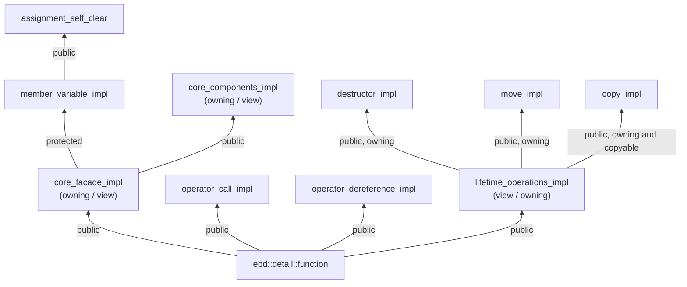

# `ebd::detail::function`

## Overview

`ebd::detail::function` is the core implementation class for all function wrappers in the Embedded Function library. It provides a lightweight, heap-free wrapper for callable objects, similar to `std::function` but with reduced overhead and deterministic performance characteristics.

## Class Structure

`ebd::detail::function` is a thin facade. Its mode-specific constructors live in `crtp_mixins::core_facade_impl` (owning/view specializations) and are inherited via `using Base_CoreFacade::Base_CoreFacade;`, so the overload set depends on `Config::isView`. Storage (`m_erasure`, `m_command`) lives in `crtp_mixins::member_variable_impl`, inherited **protected** and therefore not public. Before C++17 the inherited set excludes the default constructor, so `function() noexcept` is declared directly.

The inheritance hierarchy (`function` is `final`; all bases live in `ebd::detail::crtp_mixins`):



Edges marked `owning` exist only in owning mode; the view specialization of `lifetime_operations_impl` has no bases.

## Template Parameters

| Parameter | Description |
|-----------|-------------|
| `BufferSize` | Specifies the size reserved to store the callable object. Must be at least `sizeof(void*)`. |
| `Alignment` | Specifies the alignment of the internal storage. |
| `Config` | Specifies the configuration attributes of the wrapper. Must be a `config_package` type. |
| `Signature` | The function signature of the wrapper, e.g., `Ret(Args...)` or `Ret(Args...) const`. |

## Configuration Package

The `Config` parameter is a `config_package` struct with the following boolean fields:

| Field | Description |
|-------|-------------|
| `isCopyable` | Whether the function wrapper is copyable. |
| `isView` | Whether the function wrapper is a non-owning view. |
| `isThrowing` | Whether the wrapper throws `std::bad_function_call` when called in an empty state. |
| `assertNoThrow` | Whether the wrapper asserts that the callable object is nothrow-constructible and nothrow-destructible. |

## Member Types

| Type | Description |
|------|-------------|
| `result_type` | The return type of the function signature. |

## Member Functions

### Constructor

Owning wrappers (`ebd::fn`, `ebd::unique_fn`, `ebd::classic_fn`) provide the full set below. View wrappers (`ebd::fn_ref`) delete the empty-state and in-place constructors, and bind functors/function pointers by reference instead.

#### Default / Nullptr Constructor

```cpp
function() noexcept;
function(std::nullptr_t) noexcept;
```

Creates an empty function wrapper. Owning wrappers only (deleted for views).

#### Copy / Move Constructor

```cpp
function(const function& other) = default;
function(function&& other) = default;
```

The copy constructor is available only if `Config::isCopyable` or `Config::isView` is `true`.

#### Conversion Constructor

```cpp
template <std::size_t OtherSize, std::size_t OtherAlign, typename OtherCfg, typename OtherSig>
function(const function<OtherSize, OtherAlign, OtherCfg, OtherSig>& other);

template <std::size_t OtherSize, std::size_t OtherAlign, typename OtherCfg, typename OtherSig>
function(function<OtherSize, OtherAlign, OtherCfg, OtherSig>&& other);
```

Converts from a compatible wrapper with a different buffer size, alignment, or configuration; the source size and alignment must not exceed the target's. The copy overload exists in both modes (and requires a copyable source); the move overload only in owning mode (a view converts rvalues through copy).

#### Functor / Function Pointer Constructor

```cpp
template <typename Functor>
function(Functor&& functor);

template <typename Func>
function(Func* function_ptr) noexcept; // view wrappers only
```

Owning wrappers store the callable in the internal buffer (it must be compatible with the signature and fit the buffer size/alignment); view wrappers bind it by reference (it must be invocable as an lvalue with the signature's cv-qualification). View wrappers also accept a function pointer, which must not be null (asserted).

#### In-place Constructor (C++17+)

```cpp
template <typename Fn, typename... CArgs>
explicit function(std::in_place_type_t<Fn>, CArgs&&... args);

template <typename Fn, typename U, typename... CArgs>
explicit function(std::in_place_type_t<Fn>, std::initializer_list<U> il, CArgs&&... args);
```

Constructs the callable object in place within the internal buffer. Owning wrappers only (deleted for views).

#### Constant Wrapper Constructor (C++26+)

```cpp
// View wrappers (ebd::fn_ref)
template <auto Val, typename Fn>
constexpr function(std::constant_wrapper<Val, Fn>) noexcept;

template <auto Val, typename Fn, typename Up>
constexpr function(std::constant_wrapper<Val, Fn>, Up&& obj) noexcept;

template <auto Val, typename Fn, typename Tp>
constexpr function(std::constant_wrapper<Val, Fn>, Tp* obj) noexcept;

// Owning wrappers (ebd::fn, ebd::unique_fn, ebd::classic_fn, ebd::safe_fn)
template <auto Val, typename Fn, typename Obj>
function(std::constant_wrapper<Val, Fn>, Obj&& obj) noexcept(/*obj-constructor-nothrow*/);

template <auto Val, typename Fn, typename Obj, typename... CArgs>
explicit function(std::constant_wrapper<Val, Fn>, std::in_place_type_t<Obj>, CArgs&&... args) noexcept(/*obj-constructor-nothrow*/);

template <auto Val, typename Fn, typename Obj, typename... CArgs, typename U>
explicit function(std::constant_wrapper<Val, Fn>, std::in_place_type_t<Obj>,
         std::initializer_list<U> il, CArgs&&... args) noexcept(/*obj-constructor-nothrow*/);
```

Constructs from a `std::constant_wrapper` (P3948), available when `__cpp_lib_constant_wrapper >= 202603L`:

- View wrappers (`ebd::fn_ref`): construct from a bare `std::constant_wrapper`, from a `std::constant_wrapper` plus an lvalue object (bound by reference, removed from the signature), or from a `std::constant_wrapper` plus an object pointer (`Tp*`, non-null for member pointers). All are `constexpr`; the in-place forms are owning-only.
- Owning wrappers (`ebd::fn`, `ebd::unique_fn`, `ebd::classic_fn`): construct from a `std::constant_wrapper` plus an object, or construct the object in place from `std::in_place_type_t<Obj>` plus arguments (optionally with a leading `std::initializer_list`). The object is stored in the buffer and passed as the callable's first argument; it must be decayed (`std::is_same_v<Obj, std::decay_t<Obj>>`), constructible from the arguments, and satisfy the buffer size/alignment constraints. These constructors are **not** `constexpr` (placement `new`), their `noexcept` follows the object's construction, and the callable must be invocable with the object carrying the signature's cv/ref-qualifiers (so a non-const `&`-qualified callable needs a ref-qualified signature such as `ebd::fn<int(int) &>`).

A `static_assert` rejects null `Val` when `Fn` is a (member) function pointer.

### Assignment Operators

#### Nullptr Assignment

```cpp
function& operator=(std::nullptr_t) noexcept;
```

Assigns a null pointer, clearing the function wrapper.

#### Copy Assignment

```cpp
function& operator=(const function& other) = default;
```

Copies another function wrapper. Only available if `Config::isCopyable` or `Config::isView` is `true`.

#### Move Assignment

```cpp
function& operator=(function&& other) = default;
```

Moves another function wrapper.

#### Functor Assignment

```cpp
template <typename Functor>
function& operator=(Functor&& fn) noexcept;
```

Assigns a callable object to the function wrapper.

#### Conversion Assignment

```cpp
template <std::size_t OtherSize, typename OtherCfg, typename OtherSig>
function& operator=(const function<OtherSize, OtherCfg, OtherSig>& other);
```

Assigns from another function wrapper with a different buffer size or configuration, if compatible.

### Invocation

```cpp
Ret operator()(Args... args) C V REF NOEXCEPT;
```

Invokes the wrapped callable object with the given arguments. The cv-qualifiers and ref-qualifiers match those in the signature.

### State Management

#### is_empty

```cpp
constexpr bool is_empty() const noexcept;
```

Returns `true` if the function wrapper is empty, `false` otherwise.

#### operator bool (Deprecated)

```cpp
EMBED_DEPRECATED("Use `!f.is_empty()` instead")
constexpr explicit operator bool() const noexcept;
```

Returns `true` if the function wrapper is not empty, `false` otherwise.

> [!WARNING]
> This operator is deprecated and will be removed in a future release. It usually indicates a bug in user code: e.g., with `ebd::fn<bool()> f`, `f (f())` can be confused with `if (f)`, because the conversion only tests emptiness, not the call result. Use explicit `!f.is_empty()` instead.

#### clear

```cpp
void clear() noexcept(Config::assertNoThrow);
```

Clears the function wrapper, destroying the wrapped callable object if necessary.

#### swap

```cpp
void swap(function& fn) noexcept(Config::assertNoThrow);
```

Swaps the contents of two function wrappers. A free ADL `swap()` for the same type is also available, see [swap (Non-member Functions)](#swap-1).

### Utility

#### get_buffer_size

```cpp
static constexpr std::size_t get_buffer_size() noexcept;
```

Returns the buffer size of the function wrapper.

#### get_alignment

```cpp
static constexpr std::size_t get_alignment() noexcept;
```

Returns the alignment of the function wrapper.

#### is_copyable

```cpp
static constexpr bool is_copyable() noexcept;
```

Returns `true` if the function wrapper is copyable, `false` otherwise.

#### operator*

```cpp
function_ptr_t operator*() const noexcept;
```

If the wrapped object is a function pointer, returns that pointer; otherwise, returns `nullptr`.

## Non-member Functions

### Comparison Operators

```cpp
template <std::size_t Buf, std::size_t Align, typename Cfg, typename Sig>
bool operator==(const function<Buf, Align, Cfg, Sig>& fn, std::nullptr_t) noexcept;

template <std::size_t Buf, std::size_t Align, typename Cfg, typename Sig>
bool operator==(std::nullptr_t, const function<Buf, Align, Cfg, Sig>& fn) noexcept;

template <std::size_t Buf, std::size_t Align, typename Cfg, typename Sig>
bool operator!=(const function<Buf, Align, Cfg, Sig>& fn, std::nullptr_t) noexcept;

template <std::size_t Buf, std::size_t Align, typename Cfg, typename Sig>
bool operator!=(std::nullptr_t, const function<Buf, Align, Cfg, Sig>& fn) noexcept;
```

Compare a function wrapper with `nullptr` to check if it is empty.

### swap

```cpp
template <std::size_t Buf, std::size_t Align, typename Cfg, typename Sig>
void swap(function<Buf, Align, Cfg, Sig>& a, function<Buf, Align, Cfg, Sig>& b)
  noexcept(noexcept(a.swap(b)));
```

Exchanges the contents of the two function wrappers. It is found by argument-dependent lookup (ADL), so it is picked up by the standard two-step idiom:

```cpp
using std::swap;
swap(f1, f2); // calls the ADL swap of ebd
```

Both wrappers must be the same specialization (identical `Buf`, `Align`, `Cfg`, and `Sig`). The `noexcept` specification is inherited from the member `swap()`: it is `noexcept` for view wrappers (`ebd::fn_ref`) and for wrappers with `Config::assertNoThrow == true`, and potentially throwing otherwise (e.g. `ebd::fn`, `ebd::unique_fn`, `ebd::classic_fn`).

## Performance Characteristics

- **Heap-free**: All storage is allocated inline within the function wrapper, eliminating dynamic memory allocations.
- **Branch elimination**: Runtime checks for empty function states are eliminated during invocation.
- **Smart forwarding**: Scalar arguments and small-sized trivial arguments are passed via registers instead of the stack.
- **Deterministic**: No dynamic memory operations mean predictable real-time performance.

## Usage Examples

### Basic Usage

```cpp
#include "embed/embed_function.hpp"

// Create a function wrapper for a void() signature
ebd::detail::function<
    sizeof(void(*)()),
    ebd::detail::default_values::owning::alignment,
    ebd::detail::config_package<true, false, true, false>,
    void()
> fn;

// Assign a lambda
fn = []() { /* do something */ };

// Invoke the function
if (fn) {
    fn();
}
```

### With Custom Configuration

```cpp
// Create a move-only, non-throwing function wrapper
typedef ebd::detail::function<
    32, // 32-byte buffer
    ebd::detail::default_values::owning::alignment,
    ebd::detail::config_package<false, false, false, true>, // move-only, non-throwing, assert no-throw
    int(int, int)
> custom_fn;

custom_fn add = [](int a, int b) { return a + b; };
int result = add(10, 20); // result = 30
```

## Notes

- The `ebd::detail::function` class is not intended for direct use. Instead, use the predefined aliases such as `ebd::fn`, `ebd::unique_fn`, `ebd::classic_fn`, and `ebd::fn_ref`.
- The buffer size is automatically aligned to a multiple of the `Alignment` parameter.
- The stored callable object must fit in the buffer and have an alignment no greater than the `Alignment` parameter; otherwise a `static_assert` is triggered.
- The function wrapper supports all callable objects, including free functions, lambdas, functors, static member functions, and member functions.
- When `Config::isView` is `true`, the wrapper acts as a non-owning view, similar to `std::function_ref`.